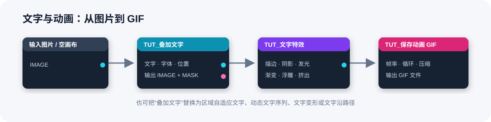
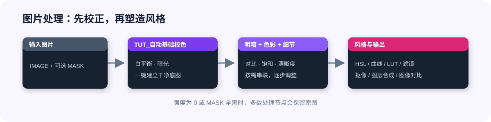
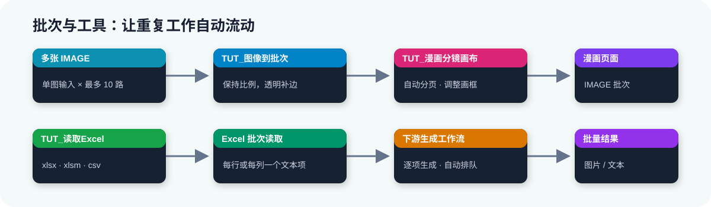

# ComfyUI_TUT_Nodes

一套以中文界面为主的 ComfyUI 实用节点。公开版包含 **63 个节点**，覆盖文字排版、图片调色、滤镜、抠像、合成、漫画分镜、音频裁剪、批次处理、Excel、LoRA 测试、潜空间放大和动画输出。


## 快速安装

把仓库放入 ComfyUI 的 `custom_nodes` 目录：

```text
ComfyUI/custom_nodes/ComfyUI_TUT_Nodes
```

然后使用 **ComfyUI 自己的 Python 环境**安装依赖：

```powershell
python -m pip install -r ComfyUI/custom_nodes/ComfyUI_TUT_Nodes/requirements.txt
```

重启 ComfyUI，在节点菜单中找到 `TUT_Nodes`。

> `AI智能抠像` 需要额外安装 `rembg`；`GIMM-VFI补帧` 需要已安装 ComfyUI-GIMM-VFI。其他可选模型会在第一次执行对应节点时按需下载。

## 三分钟认识节点

### 1. 做文字、标题和动图



先用 `叠加文字`、`区域自适应文字` 或 `文字沿路径` 生成文字，再把 MASK 交给 `文字特效`。需要动画时连接 `动态文字序列`，最后用 `保存动画 GIF` 输出。

### 2. 调色、滤镜与合成



常用顺序是：`自动基础校色` → `基础明暗调整` → `基础色彩调整` → `图像细节增强`。之后可继续使用 HSL、RGB 曲线、LUT、艺术滤镜或图层合成。

### 3. 批次、漫画和数据驱动



`图像到批次` 可把多张图片组成批次并送入 `漫画分镜画布`；Excel 节点可把表格内容转成文本列表；`LoRA强度批量测试` 可一次生成多档模型强度供下游对比。

## 节点分类

| 分类 | 适合做什么 | 代表节点 |
| --- | --- | --- |
| 图片 / 文本 | 标题、水印、文字动画、路径文字 | 叠加文字、文字特效、区域自适应文字 |
| 图片 / 调色 | 基础校色、曲线、LUT、电影风格 | 自动基础校色、RGB曲线、3D LUT调色 |
| 图片 / 滤镜 | 漫画、像素、故障、玻璃折射 | 漫画化滤镜、像素艺术滤镜 |
| 图片 / 抠像 | 颜色、AI、SAM、差异抠像 | 颜色抠像、AI智能抠像、遮罩边缘精修 |
| 图片 / 合成 | 柔边、光线包裹、深度、透视 | 柔边图层合成、四角定位合成 |
| 图片 / 漫画 | 多图自动排版和分镜 | 漫画分镜画布 |
| 音频 | 波形预览、试听与精确裁剪 | 高级音频加载 |
| 工具 | Excel、文本、批次、等待、帮助 | 读取Excel、图像到批次、节点帮助 |
| 模型与动画 | LoRA 对比、潜空间放大、补帧、GIF | LoRA强度批量测试、GIMM-VFI补帧 |

## 完整节点清单

<details>
<summary><strong>图片 / 文本（14）</strong></summary>

- `TUT_叠加文字`：在图片上绘制文字。
- `TUT_绘制文字`：生成文字画布。
- `TUT_文字遮罩填充`：把图片填入文字区域。
- `TUT_文字图像合成`：按文字遮罩合成前景和背景。
- `TUT_文字水印`：批量添加定位水印。
- `TUT_自适应反色水印`：根据底图自动反色，保持水印清晰。
- `TUT_选择字体`：选择插件字体或系统字体。
- `TUT_文字特效`：添加描边、阴影、发光、渐变、浮雕等效果。
- `TUT_区域自适应文字`：让文字自动适配指定区域。
- `TUT_逐字逐词遮罩`：按字、词或行输出独立遮罩批次。
- `TUT_字体预览墙`：分页预览可用字体。
- `TUT_动态文字序列`：生成打字、淡入、滑入、扫光等动画。
- `TUT_文字变形`：制作拱形、波浪、斜切和透视文字。
- `TUT_文字沿路径`：沿路径遮罩排列文字。

</details>

<details>
<summary><strong>图片 / 调色（14）</strong></summary>

- `TUT_自动基础校色`、`TUT_自动基础校色（高级）`
- `TUT_基础明暗调整`、`TUT_基础色彩调整`、`TUT_图像细节增强`
- `TUT_HSL基础调整`、`TUT_RGB曲线`
- `TUT_双图颜色匹配`、`TUT_电影色调塑形`
- `TUT_卤化光晕`、`TUT_镜头扩散`、`TUT_色彩压缩器`
- `TUT_LUT加载与预览`、`TUT_3D LUT调色`

</details>

<details>
<summary><strong>图片 / 滤镜与动画（8）</strong></summary>

- `TUT_复古印刷滤镜`
- `TUT_漫画化滤镜`
- `TUT_万花筒滤镜`
- `TUT_像素艺术滤镜`
- `TUT_玻璃折射滤镜`
- `TUT_故障艺术滤镜`
- `TUT_动态滤镜序列`
- `TUT_保存动画 GIF`

</details>

<details>
<summary><strong>图片 / 抠像与合成（11）</strong></summary>

- 抠像：`TUT_颜色抠像`、`TUT_AI智能抠像`、`TUT_SAM遮罩抠像`、`TUT_差异抠像`、`TUT_遮罩边缘精修`
- 合成：`TUT_柔边图层合成`、`TUT_光线包裹合成`、`TUT_深度图合成`、`TUT_四角定位合成`、`TUT_通道布尔合成`、`TUT_图像位移合成`

</details>

<details>
<summary><strong>图片 / 查看与漫画（3）</strong></summary>

- `TUT_图像对比`：使用滑动分割线比较两张图片。
- `TUT_漫画分镜画布`：把图片批次自动排成一至六格漫画，或自由绘制最多二十格；每格可拖动顶点或边中点形成抗锯齿凸形、凹形四边框，并支持逐边开放、图层、吸附和镜头预览。
- `TUT_[待测试]漫画对话框`：添加可拖动、缩放、分层和可重叠合并的对白框、自然云朵框、爆炸框、闪光框、旁白框或无边框文字；支持字体搜索、真实字体预览、横排与双向竖排，以及爆炸/闪光轮廓调节。

</details>

<details>
<summary><strong>音频（1）</strong></summary>

- `TUT_高级音频加载`：上传或选择音频，在波形上试听并按采样点精确裁剪，输出时长、边界、采样率和声道数。

</details>

<details>
<summary><strong>工具（9）</strong></summary>

- `TUT_节点帮助`：连接任意节点输出，在节点内查看使用说明。
- `TUT_文本分隔批次`：按分隔符把文本拆成列表。
- `TUT_图像到批次`：合并最多十路图片输入，不拉伸不同尺寸图片。
- `TUT_批次按编号加载`：按编号选择列表中的一项。
- `TUT_等待`：延时后原样传递任意类型数据。
- `TUT_读取Excel`：读取 `.xlsx`、`.xlsm` 或 `.csv`。
- `TUT_Excel批次读取`：按行或列输出文本列表。
- `TUT_Excel合并读取`：按行或列合并为一段文本。
- `TUT_Excel只读单行/单列`：读取指定行或列。

</details>

<details>
<summary><strong>模型、潜空间与视频（3）</strong></summary>

- `TUT_LoRA强度批量测试`：生成多档 MODEL、CLIP 和强度列表。
- `TUT_SesquiLSR潜空间放大`：放大 SDXL、Flux、Flux2、Ideogram 4 或 Wan 2.1 LATENT。
- `TUT_GIMM-VFI补帧`：复用 ComfyUI-GIMM-VFI 完成视频补帧。

</details>

## 使用提示

- 节点标题、参数和提示以中文显示；内部 ID 保留英文，以兼容旧工作流。
- 大多数图片节点支持批次，调色、滤镜和抠像节点支持可选 MASK。
- 动态文字和动态滤镜输出 IMAGE 帧批次，帧率在 `保存动画 GIF` 中设置。
- 插件字体放入 `ComfyUI_TUT_Nodes/fonts` 后重启 ComfyUI；支持 `.ttf`、`.otf`、`.ttc`。
- LUT 可放入 `ComfyUI_TUT_Nodes/luts`，也可在加载节点中上传。插件不会自动猜测 Log、Rec.709 或 ACES 色彩空间。
- Excel 采用“读取一次、处理多次”的连接方式：先连接 `读取Excel`，再连接三个 Excel 处理节点。
- SesquiLSR 模型首次使用时下载到 `models/TUT_Nodes/sesqui_lsr/`。第三方来源与许可见 [THIRD_PARTY_NOTICES.md](THIRD_PARTY_NOTICES.md)。

## 许可

本项目采用 [MIT License](LICENSE)。
